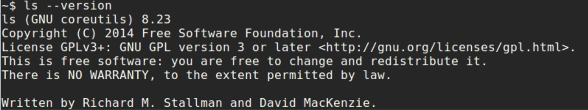

Linux 内核系统调用 第四节
================================================================================

Linux 内核如何运行程序
--------------------------------------------------------------------------------

本节是讲述 Linux 内核中[系统调用](https://en.wikipedia.org/wiki/System_call)的[章节](/SysCall/)的第四部分，正如我在[上一节](/SysCall/linux-syscall-3.md)的总结中所写的那样，本节将是本章的最后一节。在上一节中，我们停在了两个新概念上：

* `vsyscall`；
* `vDSO`；

这两个概念与系统调用的概念有关，而且非常相似。

本节是本章的最后一部分，正如你从本节标题中可以理解的那样，我们将看到当我们运行自己的程序时，Linux 内核中发生了什么。那么，让我们开始吧。

我们如何启动程序？
--------------------------------------------------------------------------------

从用户的角度来看，启动一个应用程序有许多种不同的方式。例如，我们可以在 [shell](https://en.wikipedia.org/wiki/Unix_shell) 中运行一个程序，也可以双击应用程序的图标。这无关紧要。无论我们以何种方式启动应用程序，Linux 内核都负责处理应用程序的启动。

在本节中，我们将讨论直接在 shell 中启动应用程序这种方式。如你所知，从 shell 启动应用程序的标准方式如下：我们先启动一个[终端模拟器](https://en.wikipedia.org/wiki/Terminal_emulator)应用程序，然后输入程序的名字，并向我们的程序传递参数或者不传递参数，例如：



让我们考虑一下，当我们从 shell 启动一个应用程序时发生了什么，当我们输入程序名字时 shell 做了什么，Linux 内核又做了什么，等等。但在开始讨论这些有趣的内容之前，我想提醒一下，本书是关于 Linux 内核的。因此，本节我们主要关注与 Linux 内核内部实现相关的内容。我们不会详细讨论 shell 做了什么，也不会考虑诸如子 shell 之类的复杂情况。

我默认使用的 shell 是 [bash](https://en.wikipedia.org/wiki/Bash_%28Unix_shell%29)，因此我将讨论 `bash` shell 如何启动一个程序。那么，让我们开始吧。`bash` shell 与任何用 [C](https://en.wikipedia.org/wiki/C_%28programming_language%29) 语言编写的程序一样，都是从 [main](https://en.wikipedia.org/wiki/Entry_point) 函数开始的。如果你查看 `bash` shell 的源代码，你会在 [shell.c](https://github.com/bminor/bash/blob/bc007799f0e1362100375bb95d952d28de4c62fb/shell.c#L357) 源文件中找到 `main` 函数。在 `bash` 的主线程循环开始工作之前，这个函数做了许多不同的事情。例如，这个函数会：

* 检查并尝试打开 `/dev/tty`；
* 检查 shell 是否运行在调试模式下；
* 解析命令行参数；
* 读取 shell 环境；
* 加载 `.bashrc`、`.profile` 以及其他配置文件；
* 以及许多许多其他的事情。

完成所有这些操作之后，我们可以看到对 `reader_loop` 函数的调用。这个函数定义在 [eval.c](https://github.com/bminor/bash/blob/bc007799f0e1362100375bb95d952d28de4c62fb/eval.c#L67) 源文件中，它代表主线程循环，换句话说，它读取并执行命令。当 `reader_loop` 函数完成了所有的检查、并读取了给定的程序名和参数之后，它会调用 [execute_cmd.c](https://github.com/bminor/bash/blob/bc007799f0e1362100375bb95d952d28de4c62fb/execute_cmd.c#L378) 源文件中的 `execute_command` 函数。此函数会经过如下的函数调用链：

```
execute_command
--> execute_command_internal
----> execute_simple_command
------> execute_disk_command
--------> shell_execve
```

进行各种检查，例如我们是否需要启动 `subshell`、它是不是 `bash` 的内建函数等等。正如我在上面已经写过的，我们不会讨论所有与 Linux 内核无关的细节。在这个过程的最后，`shell_execve` 函数会调用 `execve` 系统调用：

```C
execve (command, args, env);
```

`execve` 系统调用具有如下签名：

```
int execve(const char *filename, char *const argv [], char *const envp[]);
```

它按照给定的文件名执行程序，并传入给定的参数和[环境变量](https://en.wikipedia.org/wiki/Environment_variable)。在我们的场景中，它是第一个也是唯一一个系统调用，例如：

```
$ strace ls
execve("/bin/ls", ["ls"], [/* 62 vars */]) = 0

$ strace echo
execve("/bin/echo", ["echo"], [/* 62 vars */]) = 0

$ strace uname
execve("/bin/uname", ["uname"], [/* 62 vars */]) = 0
```

因此，一个用户应用程序（在我们的场景中是 `bash`）调用了系统调用，而正如我们已经知道的，下一步就是 Linux 内核。

execve 系统调用
--------------------------------------------------------------------------------

在本章的[第二节](/SysCall/linux-syscall-2.md) 中，我们已经看到了用户应用程序调用系统调用之前的准备工作，以及系统调用处理程序完成工作之后的情形。在上一段中，我们停在了对 `execve` 系统调用的调用处。这个系统调用定义在 [fs/exec.c](https://github.com/torvalds/linux/blob/16f73eb02d7e1765ccab3d2018e0bd98eb93d973/fs/exec.c) 源文件中，正如我们已经知道的，它接受三个参数：

```
SYSCALL_DEFINE3(execve,
		const char __user *, filename,
		const char __user *const __user *, argv,
		const char __user *const __user *, envp)
{
	return do_execve(getname(filename), argv, envp);
}
```

这里 `execve` 的实现相当简单，如我们所见，它只是返回 `do_execve` 函数的结果。`do_execve` 函数定义在同一个源文件中，它做了如下几件事：

* 用给定的参数和环境变量初始化两个指向用户空间数据的指针；
* 返回 `do_execveat_common` 的结果。

我们可以看到它的实现：

```C
struct user_arg_ptr argv = { .ptr.native = __argv };
struct user_arg_ptr envp = { .ptr.native = __envp };
return do_execveat_common(AT_FDCWD, filename, argv, envp, 0);
```

`do_execveat_common` 函数完成了主要的工作 —— 它执行一个新的程序。这个函数接受一组类似的参数，但如你所见，它接受的是五个参数而不是三个。第一个参数是代表我们的应用程序所在目录的文件描述符，在我们的场景中，`AT_FDCWD` 意味着给定的路径名是相对于调用进程的当前工作目录来解释的。第五个参数是标志（flags）。在我们的场景中，我们向 `do_execveat_common` 传入了 `0`。我们会在下一步检查它，稍后就会看到。

首先，`do_execveat_common` 函数检查 `filename` 指针，如果它为 `NULL` 就返回。在这之后，我们检查当前进程的标志，以确保正在运行的进程数量没有超出限制：

```C
if (IS_ERR(filename))
	return PTR_ERR(filename);

if ((current->flags & PF_NPROC_EXCEEDED) &&
	atomic_read(&current_user()->processes) > rlimit(RLIMIT_NPROC)) {
	retval = -EAGAIN;
	goto out_ret;
}

current->flags &= ~PF_NPROC_EXCEEDED;
```

如果这两个检查都通过了，我们就清除当前进程标志中的 `PF_NPROC_EXCEEDED` 标志，以避免 `execve` 失败。你可以看到，在下一步我们调用了 [kernel/fork.c](https://github.com/torvalds/linux/blob/16f73eb02d7e1765ccab3d2018e0bd98eb93d973/kernel/fork.c) 中定义的 `unshare_files` 函数，它取消共享当前任务的文件，我们还会检查这个函数的返回值：

```C
retval = unshare_files(&displaced);
if (retval)
	goto out_ret;
```

我们需要调用这个函数，以消除被 `execve` 执行的二进制文件可能发生的[文件描述符](https://en.wikipedia.org/wiki/File_descriptor)泄漏。在下一步中，我们开始准备 `bprm`，它由 `struct linux_binprm` 结构体（定义在 [include/linux/binfmts.h](https://github.com/torvalds/linux/blob/master/include/linux/binfmts.h) 头文件中）表示。`linux_binprm` 结构体用于保存装载二进制文件时所用的参数。例如，它包含 `vma` 字段（类型为 `vm_area_struct`），表示给定地址空间中一段连续区间上的单个内存区域，我们的应用程序就将被装载到那里；它还包含 `mm` 字段（该二进制文件的内存描述符）、指向内存顶部的指针，以及许多其他不同的字段。

首先，我们用 `kzalloc` 函数为这个结构体分配内存，并检查分配的结果：

```C
bprm = kzalloc(sizeof(*bprm), GFP_KERNEL);
if (!bprm)
	goto out_files;
```

在这之后，我们通过调用 `prepare_bprm_creds` 函数来开始准备 `binprm` 的凭证（credentials）：

```C
retval = prepare_bprm_creds(bprm);
	if (retval)
		goto out_free;

check_unsafe_exec(bprm);
current->in_execve = 1;
```

初始化 `binprm` 的凭证，换句话说就是初始化存放在 `linux_binprm` 结构体内部的 `cred` 结构体。`cred` 结构体包含任务的安全上下文，例如任务的真实 [uid](https://en.wikipedia.org/wiki/User_identifier#Real_user_ID)、任务的真实 [guid](https://en.wikipedia.org/wiki/Globally_unique_identifier)、用于[虚拟文件系统](https://en.wikipedia.org/wiki/Virtual_file_system)操作的 `uid` 和 `guid` 等等。在下一步中，由于我们已经完成了 `bprm` 凭证的准备工作，我们会调用 `check_unsafe_exec` 函数来检查现在是否可以安全地执行程序，并把当前进程设置为 `in_execve` 状态。

完成所有这些操作之后，我们调用 `do_open_execat` 函数，它会检查我们传给 `do_execveat_common` 函数的标志（记住 `flags` 为 `0`），在磁盘上查找并打开可执行文件，检查我们是否将从 `noexec` 挂载点装载二进制文件（我们需要避免从 [proc](https://en.wikipedia.org/wiki/Procfs) 或 [sysfs](https://en.wikipedia.org/wiki/Sysfs) 这类不包含可执行二进制文件的文件系统中执行二进制文件），接着初始化 `file` 结构体并返回指向该结构体的指针。接下来我们可以看到对 `sched_exec` 的调用：

```C
file = do_open_execat(fd, filename, flags);
retval = PTR_ERR(file);
if (IS_ERR(file))
	goto out_unmark;

sched_exec();
```

`sched_exec` 函数用于确定负载最轻、可以执行新程序的处理器，并把当前进程迁移到该处理器上。

在这之后，我们需要检查给定可执行二进制文件的[文件描述符](https://en.wikipedia.org/wiki/File_descriptor)。我们要检查的是：我们的二进制文件名是否以 `/` 符号开头（即是否是绝对路径），或者给定的可执行二进制的路径是否相对于调用进程的当前工作目录来解释，换句话说，文件描述符是否等于 `AT_FDCWD`（请阅读上文关于它的内容）。

如果其中一个检查通过，我们就设置二进制参数的文件名：

```C
bprm->file = file;

if (fd == AT_FDCWD || filename->name[0] == '/') {
	bprm->filename = filename->name;
}
```

否则，如果文件名为空，我们会根据给定可执行二进制的文件名，把二进制参数的文件名设置为 `/dev/fd/%d` 或 `/dev/fd/%d/%s`，这意味着我们将执行该文件描述符所指向的文件：

```C
} else {
	if (filename->name[0] == '\0')
		pathbuf = kasprintf(GFP_TEMPORARY, "/dev/fd/%d", fd);
	else
		pathbuf = kasprintf(GFP_TEMPORARY, "/dev/fd/%d/%s",
		                    fd, filename->name);
	if (!pathbuf) {
		retval = -ENOMEM;
		goto out_unmark;
	}

	bprm->filename = pathbuf;
}

bprm->interp = bprm->filename;
```

注意，我们不仅设置了 `bprm->filename`，还设置了 `bprm->interp`，后者将包含程序解释器的名字。目前我们只是把同样的名字写进去，但之后它会根据程序的二进制格式，被更新为程序解释器的真实名字。你可以在上文读到，我们已经为 `linux_binprm` 准备好了 `cred`。下一步是初始化 `linux_binprm` 的其他字段。首先我们调用 `bprm_mm_init` 函数并把 `bprm` 传给它：

```C
retval = bprm_mm_init(bprm);
if (retval)
	goto out_unmark;
```

`bprm_mm_init` 定义在同一个源文件中，从函数名可以理解，它进行内存描述符的初始化，换句话说，`bprm_mm_init` 函数初始化 `mm_struct` 结构体。这个结构体定义在 [include/linux/mm_types.h](https://github.com/torvalds/linux/blob/master/include/linux/mm_types.h) 头文件中，表示进程的地址空间。我们不会讨论 `bprm_mm_init` 函数的实现，因为还有许多与 Linux 内核内存管理器相关的重要内容我们尚不了解，我们只需要知道这个函数初始化了 `mm_struct`，并为它填充了一个临时的栈 `vm_area_struct`。

在这之后，我们计算传给可执行二进制文件的命令行参数个数、环境变量个数，并分别把它们设置到 `bprm->argc` 和 `bprm->envc`：

```C
bprm->argc = count(argv, MAX_ARG_STRINGS);
if ((retval = bprm->argc) < 0)
	goto out;

bprm->envc = count(envp, MAX_ARG_STRINGS);
if ((retval = bprm->envc) < 0)
	goto out;
```

如你所见，我们借助[同一个](https://github.com/torvalds/linux/blob/16f73eb02d7e1765ccab3d2018e0bd98eb93d973/fs/exec.c)源文件中定义的 `count` 函数来完成这些操作，它计算 `argv` 数组中字符串的个数。`MAX_ARG_STRINGS` 宏定义在 [include/uapi/linux/binfmts.h](https://github.com/torvalds/linux/blob/16f73eb02d7e1765ccab3d2018e0bd98eb93d973/include/uapi/linux/binfmts.h) 头文件中，从这个宏的名字可以理解，它表示传给 `execve` 系统调用的字符串的最大数目。`MAX_ARG_STRINGS` 的值是：

```C
#define MAX_ARG_STRINGS 0x7FFFFFFF
```

在计算完命令行参数和环境变量的数量之后，我们调用 `prepare_binprm` 函数。在此之前，我们已经调用过一个名字相似的函数。那个函数叫做 `prepare_binprm_cred`，它初始化了 `linux_bprm` 中的 `cred` 结构体。而现在 `prepare_binprm` 函数：

```C
retval = prepare_binprm(bprm);
if (retval < 0)
	goto out;
```

会用来自 [inode](https://en.wikipedia.org/wiki/Inode) 的 `uid` 填充 `linux_binprm` 结构体，并从二进制可执行文件中读取 `128` 个字节。只读取前 `128` 个字节是因为我们需要检查可执行文件的类型。可执行文件的其余部分我们会在后面的步骤中读取。在 `linux_bprm` 结构体准备好之后，我们通过调用 `copy_strings_kernel` 函数把可执行二进制文件的文件名、命令行参数和环境变量复制到 `linux_bprm` 中：

```C
retval = copy_strings_kernel(1, &bprm->filename, bprm);
if (retval < 0)
	goto out;

retval = copy_strings(bprm->envc, envp, bprm);
if (retval < 0)
	goto out;

retval = copy_strings(bprm->argc, argv, bprm);
if (retval < 0)
	goto out;
```

并设置指向新程序栈顶的指针，这个指针是我们在 `bprm_mm_init` 函数中设置的：

```C
bprm->exec = bprm->p;
```

栈顶将存放程序的文件名，我们把这个文件名保存到 `linux_bprm` 结构体的 `exec` 字段中。

现在我们已经填充好了 `linux_bprm` 结构体，于是调用 `exec_binprm` 函数：

```C
retval = exec_binprm(bprm);
if (retval < 0)
	goto out;
```

首先，我们在 `exec_binprm` 中保存当前任务的 [pid](https://en.wikipedia.org/wiki/Process_identifier)，以及从当前任务的[命名空间](https://en.wikipedia.org/wiki/Cgroups)中看到的 `pid`：

```C
old_pid = current->pid;
rcu_read_lock();
old_vpid = task_pid_nr_ns(current, task_active_pid_ns(current->parent));
rcu_read_unlock();
```

并调用：

```C
search_binary_handler(bprm);
```

这个函数会遍历包含不同二进制格式的处理程序（handler）链表。目前 Linux 内核支持如下二进制格式：

* `binfmt_script` —— 支持以 [#!](https://en.wikipedia.org/wiki/Shebang_%28Unix%29) 行开头的解释型脚本；
* `binfmt_misc` —— 根据 Linux 内核运行时的配置支持不同的二进制格式；
* `binfmt_elf` —— 支持 [elf](https://en.wikipedia.org/wiki/Executable_and_Linkable_Format) 格式；
* `binfmt_aout` —— 支持 [a.out](https://en.wikipedia.org/wiki/A.out) 格式；
* `binfmt_flat` —— 支持 [flat](https://en.wikipedia.org/wiki/Binary_file#Structure) 格式；
* `binfmt_elf_fdpic` —— 支持 [elf](https://en.wikipedia.org/wiki/Executable_and_Linkable_Format) [FDPIC](http://elinux.org/UClinux_Shared_Library#FDPIC_ELF) 二进制文件；
* `binfmt_em86` —— 支持在 [Alpha](https://en.wikipedia.org/wiki/DEC_Alpha) 机器上运行的 Intel [elf](https://en.wikipedia.org/wiki/Executable_and_Linkable_Format) 二进制文件。

因此，`search_binary_handler` 会尝试调用 `load_binary` 函数，并把 `linux_binprm` 传给它。如果某个二进制格式处理程序支持给定的可执行文件格式，它就开始为执行该可执行二进制文件做准备：

```C
int search_binary_handler(struct linux_binprm *bprm)
{
	...
	...
	...
	list_for_each_entry(fmt, &formats, lh) {
		retval = fmt->load_binary(bprm);
		if (retval < 0 && !bprm->mm) {
			force_sigsegv(SIGSEGV, current);
			return retval;
		}
	}

	return retval;
```

其中，例如针对 [elf](https://en.wikipedia.org/wiki/Executable_and_Linkable_Format) 的 `load_binary` 会检查 `linux_bprm` 缓冲区中的魔数（每个 `elf` 二进制文件的头部都包含魔数；记住我们已经从可执行二进制文件中读取了前 `128` 个字节），如果它不是 `elf` 二进制文件就退出：

```C
static int load_elf_binary(struct linux_binprm *bprm)
{
	...
	...
	...
	loc->elf_ex = *((struct elfhdr *)bprm->buf);

	if (memcmp(elf_ex.e_ident, ELFMAG, SELFMAG) != 0)
		goto out;
```

如果给定的可执行文件是 `elf` 格式，`load_elf_binary` 就继续执行。为了让可执行文件能够被执行，`load_elf_binary` 做了许多不同的事情。例如，它检查可执行文件的体系结构和类型：

```C
if (loc->elf_ex.e_type != ET_EXEC && loc->elf_ex.e_type != ET_DYN)
	goto out;
if (!elf_check_arch(&loc->elf_ex))
	goto out;
```

如果体系结构不正确，或者可执行文件既不是可执行类型也不是共享类型，就退出。接着它尝试装载 `program header table`（程序头表）：

```C
elf_phdata = load_elf_phdrs(&loc->elf_ex, bprm->file);
if (!elf_phdata)
	goto out;
```

它描述了各个[段](https://en.wikipedia.org/wiki/Memory_segmentation)。从磁盘读取 `program interpreter`（程序解释器）以及与我们的可执行二进制文件链接的库，并把它们装载到内存中。`program interpreter` 在可执行文件的 `.interp` 节中指定，你可以在讲述[链接器](/Misc/linux-misc-3.md)的部分读到，对于 `x86_64` 而言它就是 `/lib64/ld-linux-x86-64.so.2`。它设置栈，并把 `elf` 二进制文件映射到内存中正确的位置。它映射 [bss](https://en.wikipedia.org/wiki/.bss) 和 [brk](http://man7.org/linux/man-pages/man2/sbrk.2.html) 节，还做了许多许多其他不同的事情，以便为执行可执行文件做好准备。

在 `load_elf_binary` 执行结束时，我们调用 `start_thread` 函数并向它传递三个参数：

```C
	start_thread(regs, elf_entry, bprm->p);
	retval = 0;
out:
	kfree(loc);
out_ret:
	return retval;
```

这三个参数是：

* 新任务的[寄存器](https://en.wikipedia.org/wiki/Processor_register)集合；
* 新任务的入口点地址；
* 新任务的栈顶地址。

从函数名可以理解，它启动一个新线程，但事实并非如此。`start_thread` 函数只是准备好新任务的寄存器，使其处于可以运行的状态。让我们看看这个函数的实现：

```C
void
start_thread(struct pt_regs *regs, unsigned long new_ip, unsigned long new_sp)
{
        start_thread_common(regs, new_ip, new_sp,
                            __USER_CS, __USER_DS, 0);
}
```

如我们所见，`start_thread` 函数只是调用了 `start_thread_common` 函数，后者会为我们完成所有工作：

```C
static void
start_thread_common(struct pt_regs *regs, unsigned long new_ip,
                    unsigned long new_sp,
                    unsigned int _cs, unsigned int _ss, unsigned int _ds)
{
        loadsegment(fs, 0);
        loadsegment(es, _ds);
        loadsegment(ds, _ds);
        load_gs_index(0);
        regs->ip                = new_ip;
        regs->sp                = new_sp;
        regs->cs                = _cs;
        regs->ss                = _ss;
        regs->flags             = X86_EFLAGS_IF;
        force_iret();
}
```

`start_thread_common` 函数把 `fs` 段寄存器填为零，并用数据段寄存器的值填充 `es` 和 `ds`。在这之后，我们为[指令指针](https://en.wikipedia.org/wiki/Program_counter)、`cs` 段等设置新的值。在 `start_thread_common` 函数的末尾，我们可以看到 `force_iret` 宏，它强制通过 `iret` 指令从系统调用返回。好了，我们已经准备好让新线程在用户空间中运行，现在我们可以从 `exec_binprm` 返回，于是我们又回到了 `do_execveat_common` 中。当 `exec_binprm` 执行结束之后，我们释放之前分配的结构体所占用的内存并返回。

当我们从 `execve` 系统调用的处理程序返回之后，我们的程序就将开始执行。我们之所以能够这样做，是因为所有与上下文相关的信息都已经为此配置好了。正如我们所看到的，`execve` 系统调用并不会把控制权返回给进程，调用进程的代码段、数据段和其他段只是被新程序的各个段覆盖了。我们应用程序的退出将通过 `exit` 系统调用来实现。

就是这样。从这一刻起，我们的程序就开始执行了。

总结
--------------------------------------------------------------------------------

这是关于 Linux 内核中系统调用概念的第四节的结尾。在这四节中，我们几乎看到了与系统调用概念相关的全部内容。我们从理解系统调用的概念开始，了解了它是什么，以及用户应用程序为什么需要它。接着我们看到了 Linux 如何处理来自用户应用程序的系统调用。我们还认识了两个与系统调用概念相似的概念 —— `vsyscall` 和 `vDSO`，最后我们看到了 Linux 内核如何运行一个用户程序。

如果你有任何问题或建议，欢迎在 Twitter 上联系 [0xAX](https://twitter.com/0xAX)，给我发[邮件](mailto:anotherworldofworld@gmail.com)，或者直接创建一个 [issue](https://github.com/0xAX/linux-insides/issues/new)。

链接
--------------------------------------------------------------------------------

* [System call](https://en.wikipedia.org/wiki/System_call)
* [shell](https://en.wikipedia.org/wiki/Unix_shell)
* [bash](https://en.wikipedia.org/wiki/Bash_%28Unix_shell%29)
* [entry point](https://en.wikipedia.org/wiki/Entry_point)
* [C](https://en.wikipedia.org/wiki/C_%28programming_language%29)
* [environment variables](https://en.wikipedia.org/wiki/Environment_variable)
* [file descriptor](https://en.wikipedia.org/wiki/File_descriptor)
* [real uid](https://en.wikipedia.org/wiki/User_identifier#Real_user_ID)
* [virtual file system](https://en.wikipedia.org/wiki/Virtual_file_system)
* [procfs](https://en.wikipedia.org/wiki/Procfs)
* [sysfs](https://en.wikipedia.org/wiki/Sysfs)
* [inode](https://en.wikipedia.org/wiki/Inode)
* [pid](https://en.wikipedia.org/wiki/Process_identifier)
* [namespace](https://en.wikipedia.org/wiki/Cgroups)
* [#!](https://en.wikipedia.org/wiki/Shebang_%28Unix%29)
* [elf](https://en.wikipedia.org/wiki/Executable_and_Linkable_Format)
* [a.out](https://en.wikipedia.org/wiki/A.out)
* [flat](https://en.wikipedia.org/wiki/Binary_file#Structure)
* [Alpha](https://en.wikipedia.org/wiki/DEC_Alpha)
* [FDPIC](http://elinux.org/UClinux_Shared_Library#FDPIC_ELF)
* [segments](https://en.wikipedia.org/wiki/Memory_segmentation)
* [Linkers](/Misc/linux-misc-3.md)
* [Processor register](https://en.wikipedia.org/wiki/Processor_register)
* [instruction pointer](https://en.wikipedia.org/wiki/Program_counter)
* [Previous part](/SysCall/linux-syscall-3.md)
